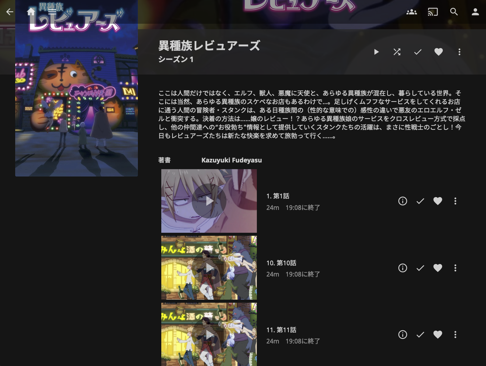
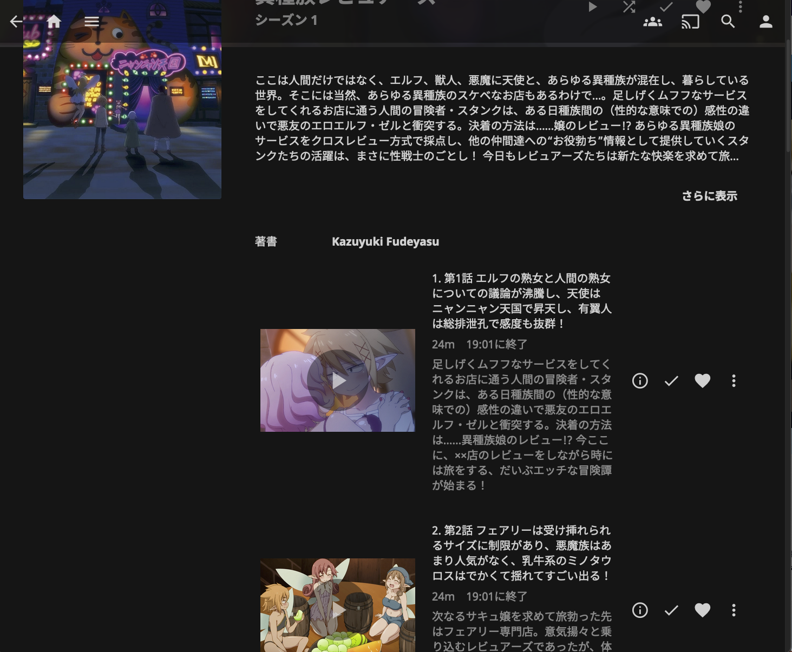
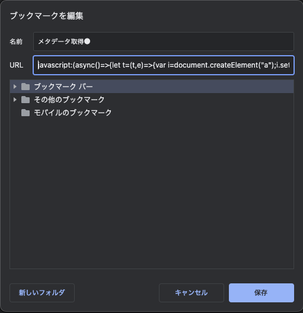
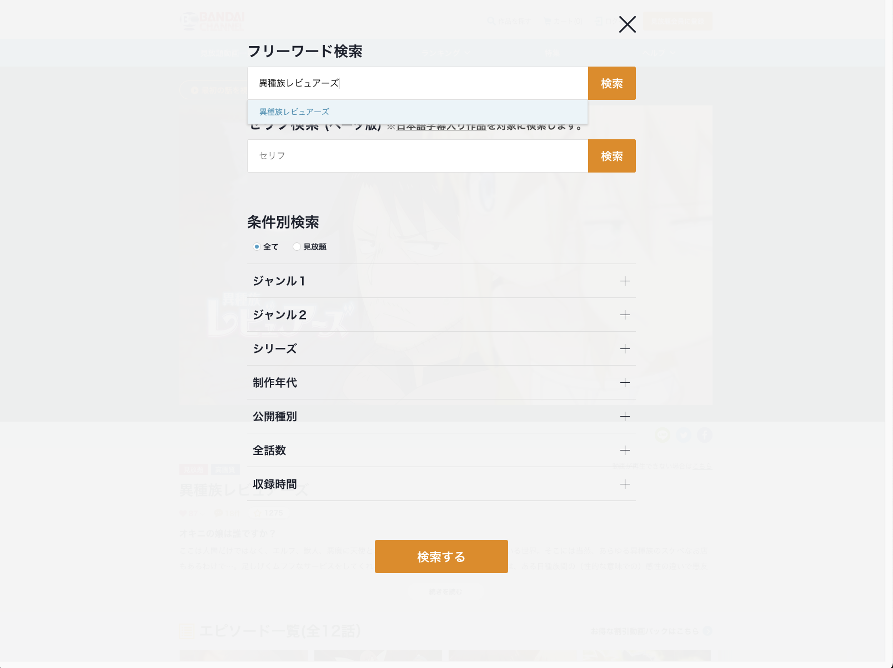
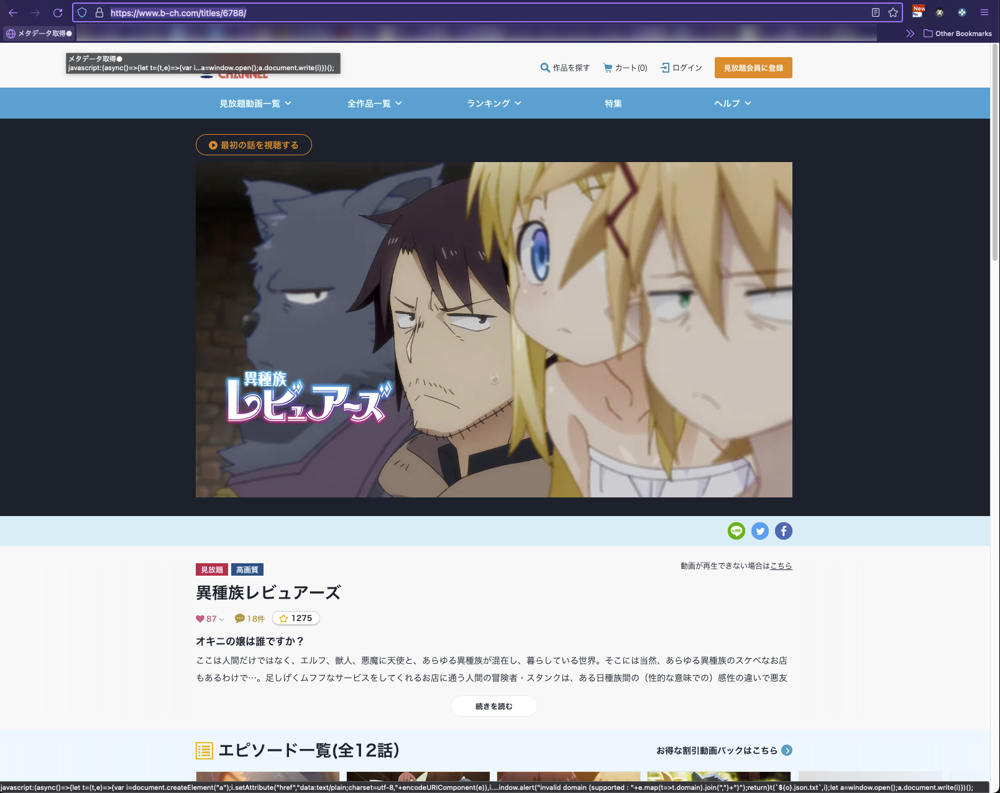
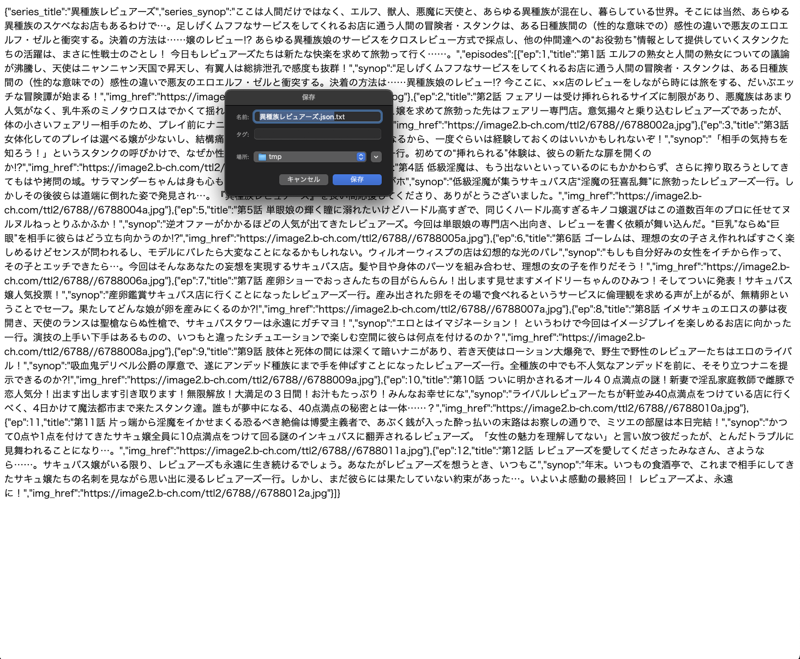
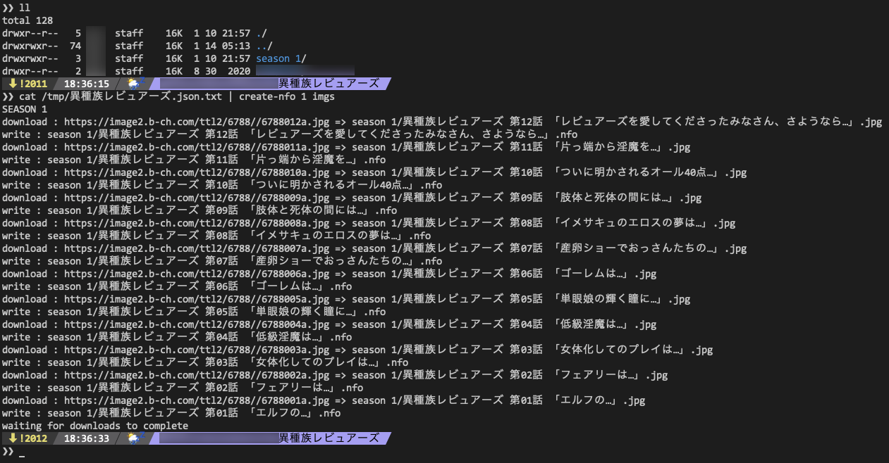
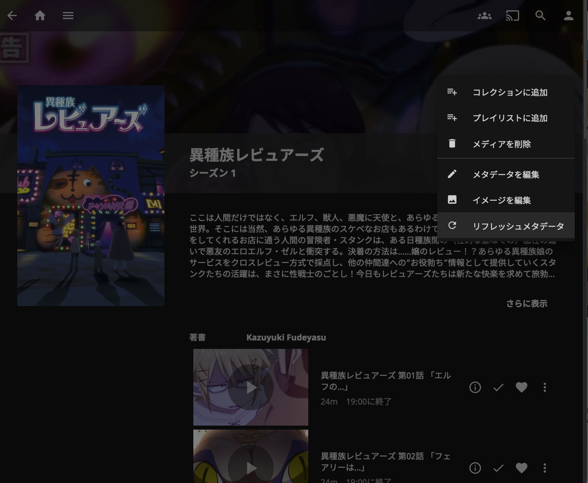
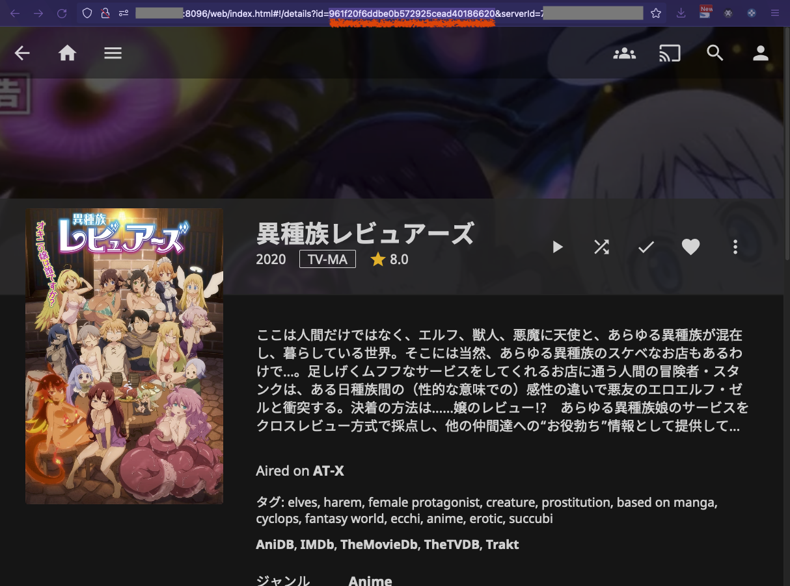

プライムビデオ、dアニメストア、バンダイCHから番組メタデータ（各話あらすじ、サムネ画像）を吸い取ります。個人メディアサーバ[Jellyfin](https://jellyfin.org/)用のメタデータNFOファイルを生成します。

- 注：違法ダウンロードや、DVDのリッピングは絶対にやめましょう

BEFORE：[](images/0.png) ➔ AFTER： [](images/7.png)


## 事前準備

1. 環境整備

    - linux またはmacOS (windowsの場合はbash）
    - [nodeJS](https://nodejs.org/) > 14
    - jq ≥ 1.6
    - (任意) [jellyfin](https://jellyfin.org/)
    
1. git clone

	```
	git clone https://github.com/cocoabox/steal-video-metadata
	cd steal-video-metadata
	```

1. install

	```
	npm i
	ln -s  $PWD/create-nfo.js  /usr/local/bin/create-nfo
	ln -s  $PWD/update-episodes-from-json.sh  /usr/local/bin/update-jellyfin-ep
	```

2. ブックマークレットを作成する
    - 名前：`メタデータ取得` (適当でおｋ）
    - アドレス: `javascript:(steal-html.min.jsの中身)`

	[](images/bookmarklet.png)
	
3. （任意）Jellyfinサーバのアドレスや、API KEY設定を行う。`steal-video-metadata/conf/*.txt` を作成する。 API KEYは：`http://JELLYFIN_HOST:8096/web/index.html#!/apikeys.html` から生成できます。
	
	```
	mkdir conf
	echo "http://JELLYFIN_HOST:8096" > conf/host.txt
	echo "JELLYFIN_API_KEY" > conf/api-key.txt
	```	

## ディレクトリ構造

```
shows/番組名　←─── 以下（★）は このディレクトリから実行します
├── season 1
│   ├── 番組名 01.mp4
│   ├── 番組名 02.mp4 
:   :          :
│   └── 番組名 12.mp4
└── season 2
    ├── 番組名 S2E01.mp4
    ├── 番組名 S2E09.mp4
    :            :
    └── 番組名 S2E10.mp4
```
　

## メタデータ吸い取り手順

1. アマプラ、ｄアニメストア、バンダイChの番組ページを開く

	[](images/1.png) ➔
	[](images/2.png)
	
1. ブックマークレットを押す

1. 成功した場合、JSONデータが表示され、テキストファイルが生成されるので、それをダウンロードするか、JSONデータをクリップボードにコピーする

	[](images/3.png)

## Jellyfin メタデータ更新手順

### .nfo, .jpg ファイルを番組ディレクトリで作成したい場合

1.★番組ディレクトリから

  ```
  cat 番組.json | create-nfo 1 imgs
  ```
    
  - season 1 以外の場合、`create-nfo [SEASON番号]`
  - サムネをダウンロードしない場合、第２引数の`imgs`は省略
      
  [](images/4.png)

1. Jellyfin Web 画面から番組のシーズンページを開き、「⟳リフレッシュメタデータ」を押す。「新しいファイルとアップデートされたファイルをスキャン」を選び、【リフレッシュ】ボタンを押す。

  	[](images/5.png)
  	[](images/6.png)

1. Jelly finのシーズンページをリロードする

### .nfo, .jpg ファイルを作成せず、直接Jellyfinサーバのデータベースを更新した場合

1. 事前準備の (4) を済ませる

1. メタデータJSONファイルを用意する（上記《メタデータ吸い取り手順》の (1) 〜 (3)

1. Jellyfinの番組ページ（シーズン1,2,3が並んでるページ）を開き、アドレスバーからShowId をコピーする

	[](images/show-id.png)
	
1. コマンドラインを叩く（シーズン１の場合）。以下SHOW_IDは適宜なShowId文字列に入れ替える。

	```
	cat 番組.json | update-jellyfin-ep SHOW_ID    1     
	```
