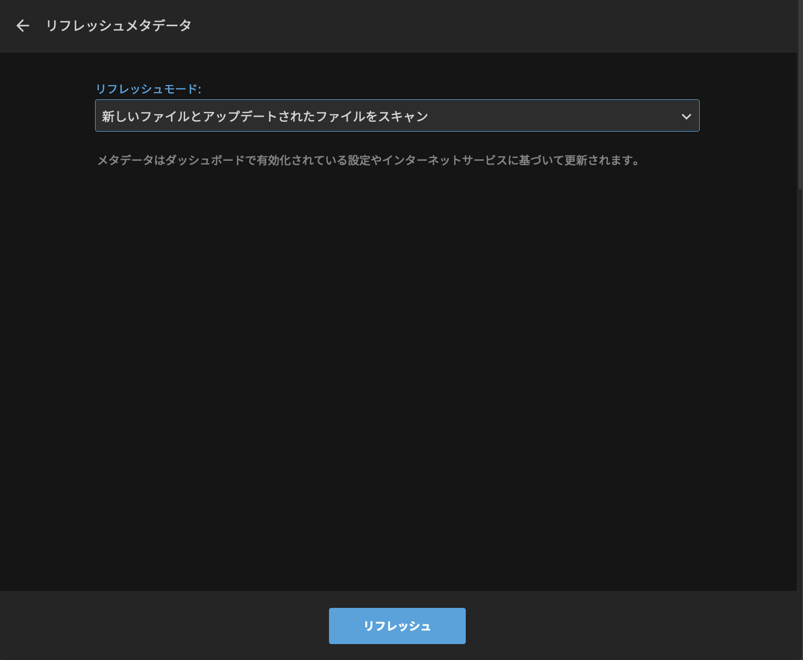

プライムビデオ、dアニメストア、バンダイCHから番組メタデータ（各話あらすじ、サムネ画像）を吸い取ります。個人メディアサーバ[Jellyfin](https://jellyfin.org/)用のメタデータNFOファイルを生成します。

- 注：違法ダウンロードや、DVDのリッピングは絶対にやめましょう

BEFORE：[](images/0.png) ➔ AFTER： [](images/7.png)


## 事前準備

1. git clone

	```
	git clone https://github.com/cocoabox/steal-video-metadata
	cd steal-video-metadata
	```

1. install

	```
	npm i
	ln -s  $PWD/create-nfo.js  /usr/local/bin/create-nfo
	```

2. ブックマークレットを作成する
    - 名前：`メタデータ取得` (適当でおｋ）
    - アドレス: `javascript:(steal-html.min.jsの中身)`

	[](images/bookmarklet.png)

## ディレクトリ構造

```
shows/番組名　←─── 以下（４）は このディレクトリから実行します
├── season 1
│   ├── 番組名 01.mp4
│   ├── 番組名 02.mp4 
:   :          :
│   └── 番組名 12.mp4
└── season 2
    ├── 番組名 S2E01.mp4
    ├── 番組名 S2E09.mp4
    :            :
    └── 番組名 S2E10.mp4
```
　

## メタデータ吸い取り・更新手順

1. アマプラ、ｄアニメストア、バンダイChの番組ページを開く

	[](images/1.png) ➔
	[](images/2.png)
	
1. ブックマークレットを押す

1. 成功した場合、JSONデータが表示され、テキストファイルが生成されるので、それをダウンロードするか、JSONデータをクリップボードにコピーする

	[](images/3.png)


1. 番組ディレクトリから

    ```
    cat 番組.json | create-nfo 1 imgs
    ```

    - season 1 以外の場合、`create-nfo [SEASON番号]`
    - サムネをダウンロードしない場合、第２引数の`imgs`は省略
      
  	[](images/4.png)

1. Jellyfin Web 画面から番組のシーズンページを開き、「⟳リフレッシュメタデータ」を押す。「新しいファイルとアップデートされたファイルをスキャン」を選び、【リフレッシュ】ボタンを押す。

  	[](images/5.png)
  	[](images/6.png)

1. Jelly finのシーズンページをリロードする